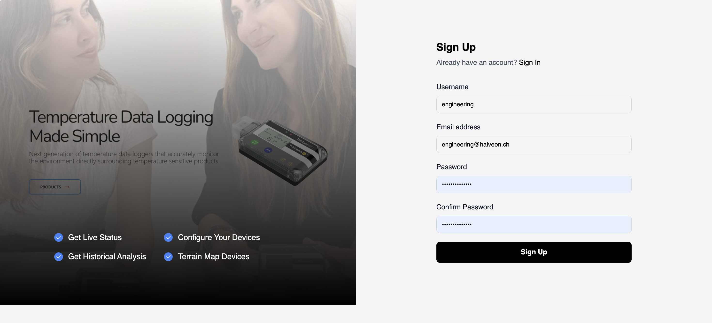

# Register Customer

New users can sign up for HalveonCloud by completing the registration form.

## Steps to Register
1. Navigate to the **Register Customer** page.
2. Fill in the required details:
   - **Username**
   - **Email Address**
   - **Password**
   - **Confirm Password**
3. Click **Sign Up** to create your account.

## Post-Registration Benefits
- Post Signup you will recieve the credential on email through autogenerated mail
- Access to the HalveonCloud platform for managing devices.
- Get email notifications for updates and alerts.
- Monitor your devices in real-time from the dashboard.
