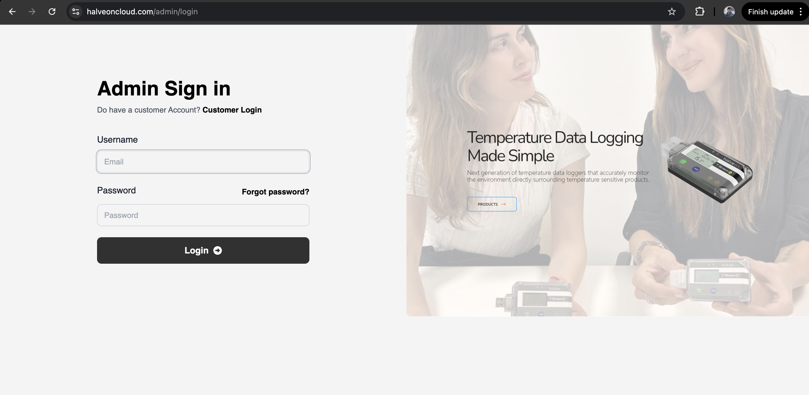

# HalveonCloud User Access

HalveonCloud provides three key access points for managing your account and devices:

1. **Login Customer**: For existing customers to access their dashboard.
2. **Register Customer**: For new customers to create an account.
3. **Admin Login**: For administrators to manage the platform and customer accounts.

---

## Login Customer

The **Login Customer** page allows existing users to access their HalveonCloud dashboard and manage their devices.

### Steps to Login:
1. Navigate to the **Customer Login** page.
2. Enter your registered **Email Address** and **Password**.
3. Click the **Login** button.
4. If you forgot your password, click **Forgot Password?** to reset it.

### Features Available After Login:
- **View Device Dashboard**: Monitor real-time and historical temperature and humidity data.
- **Device Management**: Configure devices, start/stop monitoring, and set alerts.
- **Flight Mode**: Add and manage flight configurations for device usage during travel.
- **Export Data**: Download data in CSV format for offline analysis.

---

## Register Customer

New users can sign up for HalveonCloud by completing the registration form.

### Steps to Register:
1. Navigate to the **Register Customer** page.
2. Enter the following details:
   - **Username**: A unique username for your account.
   - **Email Address**: Your valid email address.
   - **Password**: Create a secure password.
   - **Confirm Password**: Re-enter the password for confirmation.
3. Click **Sign Up** to complete your registration.

### Post-Registration:
- Once registered, you will receive a confirmation email.
- Log in to your account to access the dashboard and begin managing your devices.

---

## Admin Login

The **Admin Login** page is for administrators who manage customer accounts and the HalveonCloud platform.

### Steps to Admin Login:
1. Navigate to the **Admin Login** page.
2. Enter your **Username** and **Password**.
3. Click the **Login** button.
4. If you manage customer accounts, switch to the **Customer Login** page from the link provided.

### Features for Admins:
- **Manage Customer Accounts**: Add, update, or deactivate customer accounts.
- **Monitor Platform Usage**: View system metrics, user activity, and logs.
- **Configurations**: Set global configurations for device settings and alerts.

---

## Features Overview

Each access point provides specific functionalities:

| Access Type      | Features                                                             |
|------------------|----------------------------------------------------------------------|
| **Login Customer** | View and manage devices, analyze data, and receive alerts.         |
| **Register Customer** | Create an account to start using HalveonCloud.                  |
| **Admin Login**   | Manage customer accounts, monitor platform usage, and configurations.|

---
