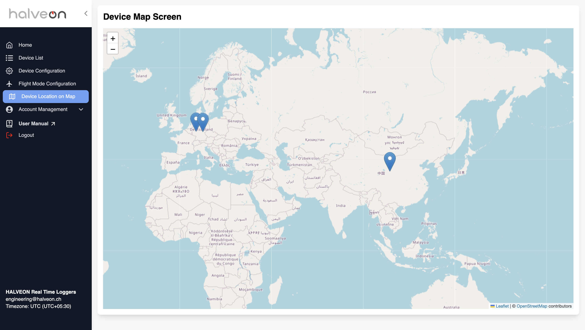
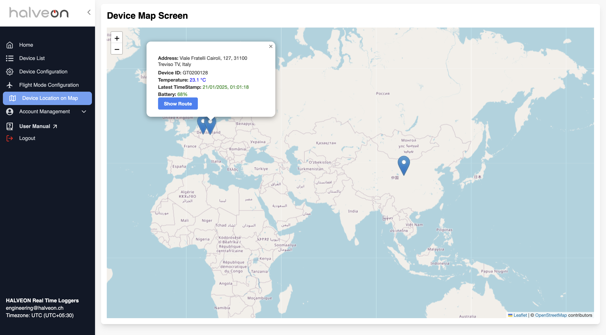
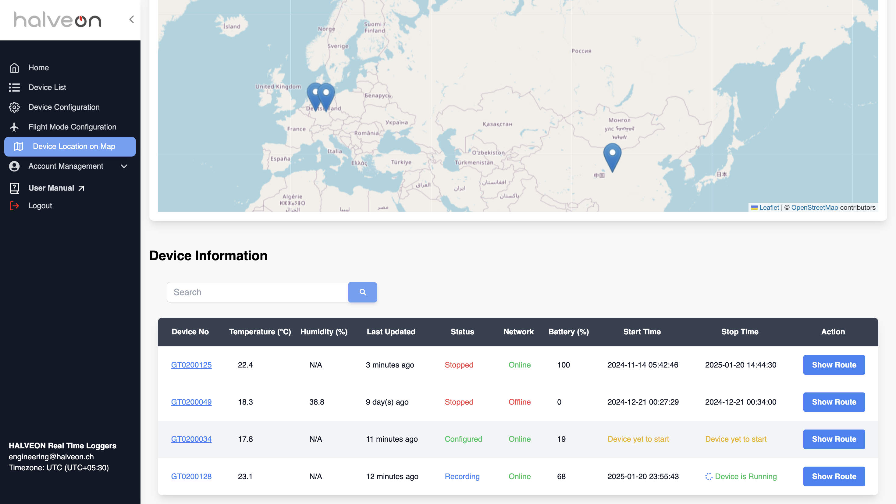
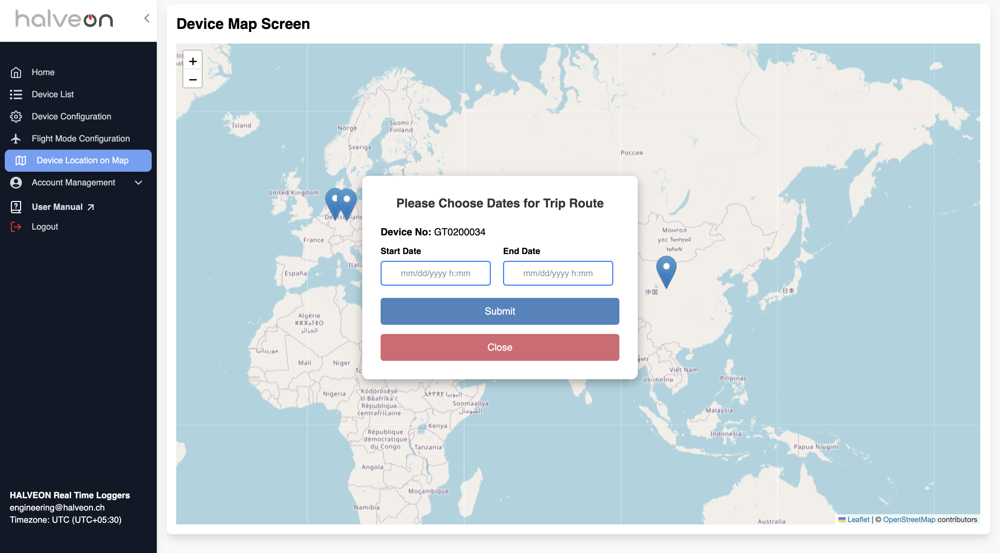
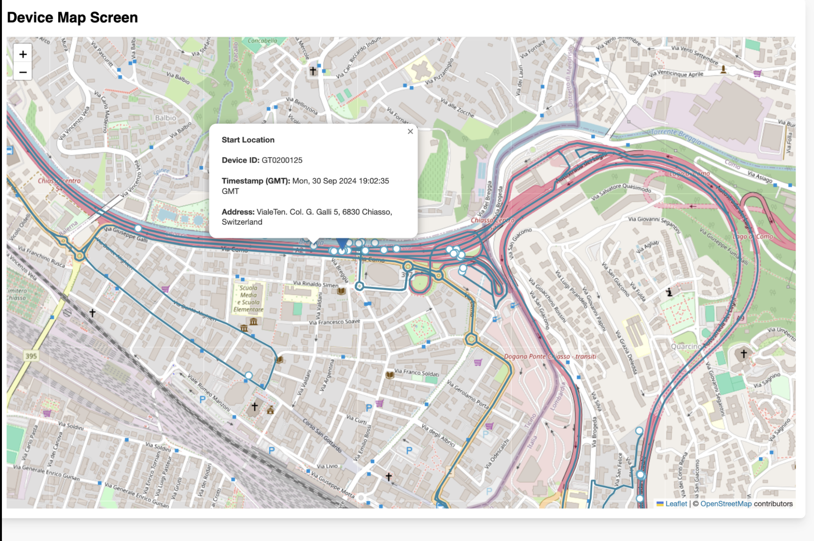
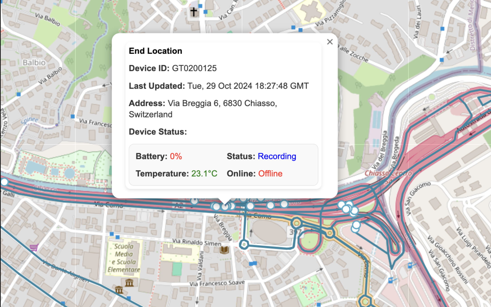

# Device Location on Map

## Overview
The **Device Location on Map** page provides an intuitive interface to visualize the current locations of all devices assigned to a customer. It also allows users to track device routes over a specified time range, view start and end locations, and inspect details of intermediate points.

---

## Features

### 1. Default View
- By default, the map displays the current location of all devices assigned to the customer.
- Each device is marked with a pinpoint on the map.

---

### 2. View Device Stats
- Clicking on a marker displays detailed information about the device.
    - **Device ID**
    - **Temperature**
    - **Battery Percentage**
    - **Last Updated Timestamp**
    - **Status**
- The details are displayed in an interactive popup.

---

### 3. Device Table
- Below the map, a table lists all devices with the following columns:
    - **Device Number**
    - **Temperature (°C)**
    - **Humidity (%)**
    - **Last Updated**
    - **Status**
    - **Network**
    - **Battery (%)**
    - **Start Time**
    - **Stop Time**
    - **Action (Show Route)**
- The "Show Route" button allows users to track the device's route over a selected time range.

---

### 4. Route Tracking
#### **Popup for Date Range**
- Clicking the "Show Route" button opens a popup to specify the date range for route tracking.
    - Fields:
        - **Start Date**
        - **End Date**
    - Actions:
        - **Submit**
        - **Close**

---

#### **Route Display**
- After submitting the date range, the map displays the route traveled by the device between the specified dates.
- Additional markers and details are displayed:
    - **Start Location**: Includes device ID, timestamp, and start address.
    - **End Location**: Includes device ID, timestamp, and end address.
    - **Intermediate Details**: Clicking on any point on the route reveals the timestamp and location for that point.

---

## More Insights Details Screenshots

### Start Location Details
- Clicking on the starting point of the route displays the following information:
  - Device ID
  - Timestamp
  - Address

---

### End Location Details
- Clicking on the endpoint of the route displays:
  - Device ID
  - Last Updated Timestamp
  - Address
  - Device Status (Battery, Recording Status, Temperature, Network Status)

---

### Intermediate Details
- Clicking on any intermediate point on the route displays detailed information about that point, including:
  - Device ID
  - Timestamp
  - Address

## Quick Guide

### Steps to Use:
1. **Default View**: Open the Device Location on Map page to see the current locations of all devices.
2. **View Device Stats**: Click on any marker to view detailed device statistics.
3. **Show Route**: Use the table below the map to find a device and click the **Show Route** button.
4. **Specify Date Range**: In the popup, select the start and end dates for the route and click **Submit**.
5. **Inspect Route**: View the device path, including start, end, and intermediate locations, by clicking on the respective points.

This feature ensures seamless visualization of device locations and routes for efficient monitoring and management.
