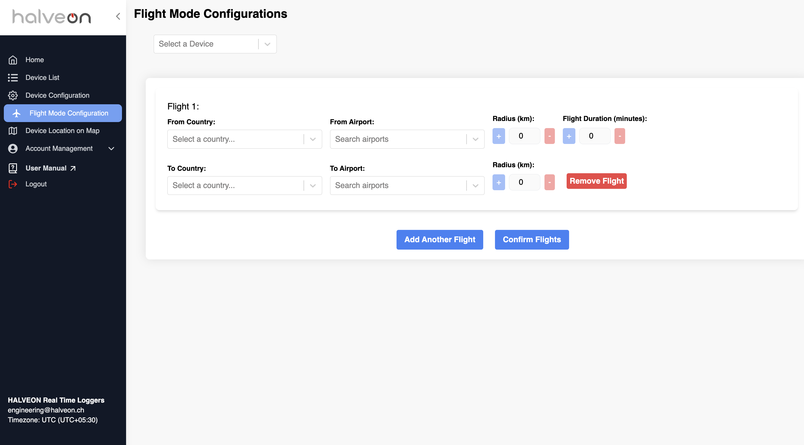
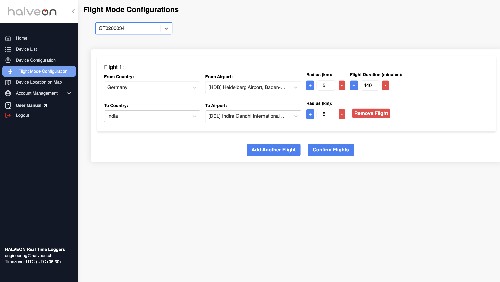
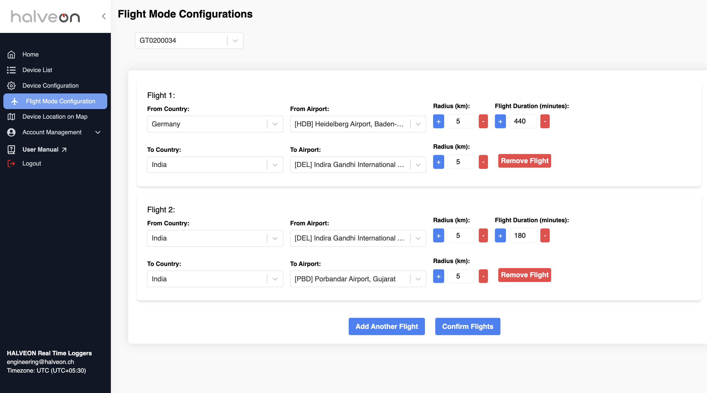
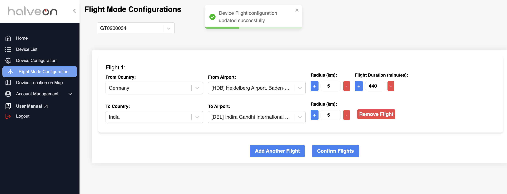
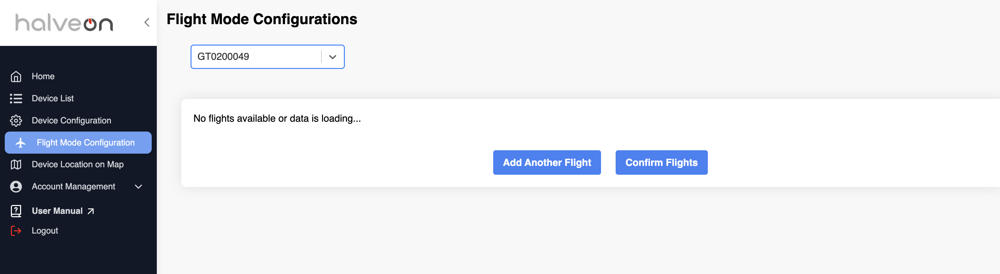
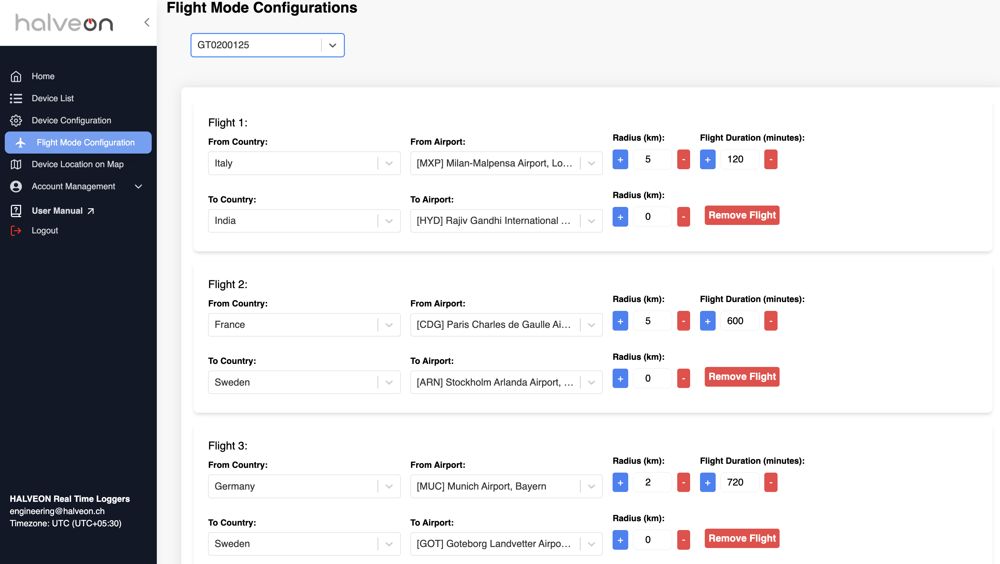

# Flight Mode Configuration Page

## Overview
The **Flight Mode Configuration** page allows users to manage flight-related settings for a selected device. Users can define departure and arrival details, set radius and flight durations, and manage multiple flight entries. This feature is designed to provide precise control over the device's airplane mode functionality.

---

## Features

### 1. Select Device
- A dropdown menu allows users to select the device to configure.
- Configuration fields are disabled until a device is selected.

---

### 2. Flight Details Configuration

#### **Departure Details**
| Field                | Description                                                                 |
|----------------------|-----------------------------------------------------------------------------|
| **From Country**     | Select the departure country from the dropdown menu.                       |
| **From Airport**     | Search and select the departure airport.                                   |
| **Radius (from)**    | Adjust the radius around the departure airport (in kilometers).            |
| **Flight Duration**  | Set the flight duration in minutes.                                        |

#### **Arrival Details**
| Field                | Description                                                                 |
|----------------------|-----------------------------------------------------------------------------|
| **To Country**       | Select the destination country from the dropdown menu.                    |
| **To Airport**       | Search and select the arrival airport.                                    |
| **Radius (to)**      | Adjust the radius around the arrival airport (in kilometers).             |

---

### 3. Manage Flights
- **Add Another Flight**: Click this button to add a new flight entry.
- **Remove Flight**: Click the "Remove Flight" button next to a flight entry to delete it.

---

### 4. Confirm Configuration
- Once all flight details are entered, click on the **Confirm Flights** button to save and apply the settings.
- A success message will appear upon successful configuration.

---

## Quick Guide

### Steps to Configure Flights:
1. **Select Device**: Use the dropdown menu to choose a device.
2. **Define Departure Details**: Set the country, airport, radius, and flight duration for departure.
3. **Define Arrival Details**: Set the country, airport, and radius for arrival.
4. **Add/Remove Flights**: Manage multiple flights as needed.
5. **Confirm Settings**: Save the configuration by clicking the **Confirm Flights** button.

---

### Examples

#### Example 1: No Flights Configured
- If no flights are configured for a selected device, the page will display a message indicating that there are no available flights.

#### Example 2: Multiple Flights Configured
- For devices with existing flight configurations, the page will display the current flight details and allow users to edit or add new flights.

---

## Final Notes
This feature ensures precise configuration of flight mode settings to optimize device performance during air travel or specific use cases.
