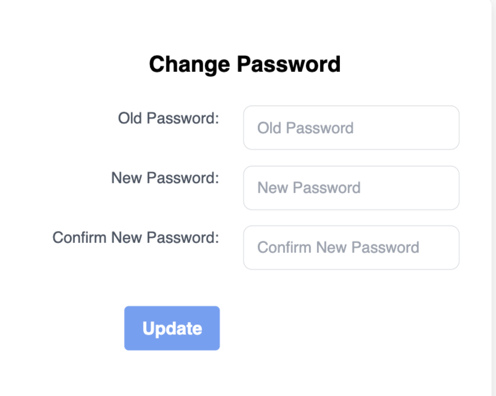

# Account Management

## Overview

The **Account Management** section enables users to manage their accounts, devices, and settings efficiently. This feature is customized for both primary and secondary users, providing them with access to relevant tools and options.

---

## Features for Primary Users

### 1. Password Change
- **Access**: Primary users can change their passwords from the **Account Management** menu.
- **Steps**:
  1. Provide the current password.
  2. Enter a new password (requirements: minimum 8 characters, at least 1 special character, cannot be the same as the current password).
  3. Confirm the new password.
  4. Click on the **Update** button to save changes.
- **Error Handling**:
  - The system ensures that the new password meets the security criteria.
  - If requirements are not met, an error message will be displayed.

---

### 2. Add/Delete Device
- **Purpose**: Allows users to manage devices linked to their account.
- **Add Device**:
  - Adding a new device requires Admin approval. Users must contact Admin to add a device to their account.
- **Delete Device**:
  - Devices can be removed if they are:
    - No longer needed.
    - Lost.
    - Corrupted or broken.
  - Users can delete devices directly from their account.

---

### 3. Select Timezone
- **Purpose**: Allows users to set their preferred timezone for viewing historical device data.
- **Steps**:
  1. Open the dropdown to view available timezones.
  2. Select the desired timezone.
  3. Click on the **Save Timezone** button.
- **Result**:
  - The selected timezone is applied to all device data and historical logs for the user.

---

### 4. Profile Management
- **Purpose**: Enables users to update their account information and manage linked devices or email addresses.
- **Editable Information**:
  - Address (line 1 and line 2).
  - City.
  - State.
  - Secondary Emails.
  - Devices (removal only).
- **Email Management**:
  - Users can add secondary email addresses to their account.
  - Once added, the secondary email will receive an auto-generated email with a password to log in to the platform.

---

## Features for Secondary Users

### Password Change
- Secondary users are only allowed to change their passwords.
- The process and requirements are identical to the primary user’s password change workflow.

---

## Quick Guide to Account Management

### For Primary Users
1. **Password Change**: Navigate to **Account Management > Change Password**. Follow the steps to update your password securely.
2. **Add/Delete Device**: Manage your devices by deleting old or damaged ones. For adding devices, contact Admin.
3. **Select Timezone**: Update the timezone for better alignment of device data with local time.
4. **Edit Profile**: Update personal information, manage linked devices, and add secondary emails.

### For Secondary Users
1. **Password Change**: Access **Account Management > Change Password** to update your password as per security requirements.

---

## Notes
- All changes are reflected in real-time and are secured using platform-level encryption.
- Adding new devices or emails may involve additional verification steps for security purposes.
