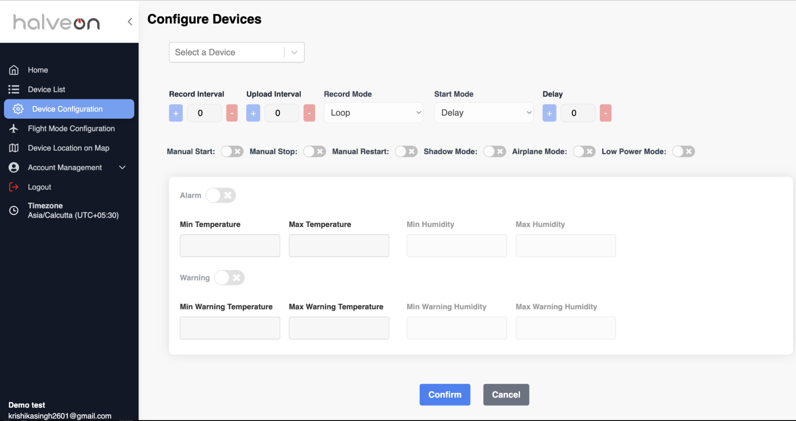
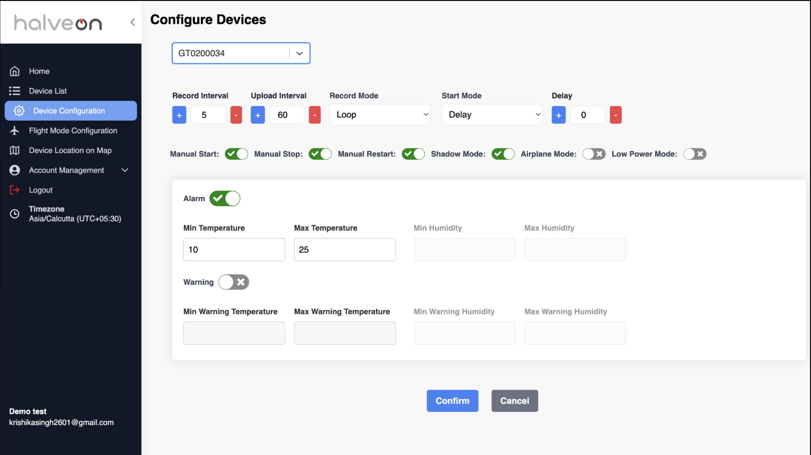
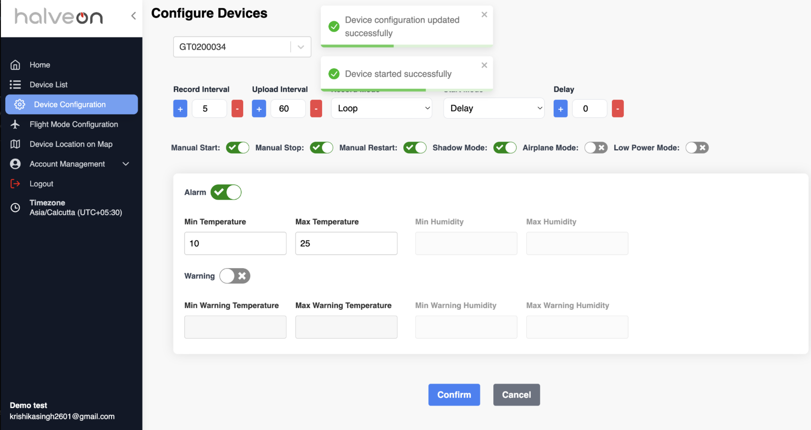
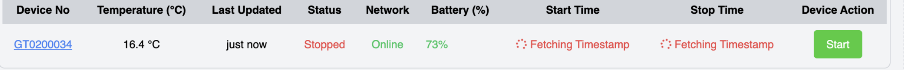
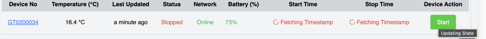
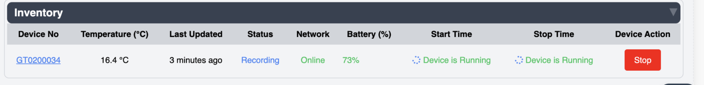
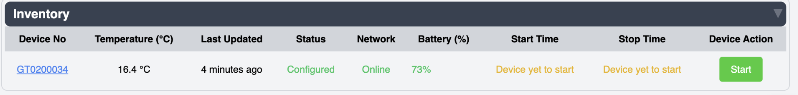

# Device Configuration Page

## Overview
The **Device Configuration** page enables users to configure essential settings for a selected device. This feature includes options to adjust recording intervals, upload intervals, alarms, and other device functionalities. Users can tailor the device settings based on specific use cases like power management, data recording, and alarm notifications.

---

## Features

### 1. Select Device
- A dropdown menu allows users to select the device to configure.
- Configuration fields are disabled until a device is selected.

---

### 2. Configuration Fields

#### **Intervals**
| Field             | Description                                                                                 |
|-------------------|---------------------------------------------------------------------------------------------|
| **Record Interval** | Set the interval for recording data. Minimum interval is 1 minute.                          |
| **Upload Interval** | Define how frequently data is uploaded to the platform. Frequent uploads may consume power. |

#### **Modes**
| Field          | Description                                                                                  |
|----------------|----------------------------------------------------------------------------------------------|
| **Record Mode** | Choose between:                                                                             |
|                | **Single Mode**: Device stops recording when memory is full.                                |
|                | **Loop Covering Mode**: Overwrites the oldest data when memory is full.                     |
| **Start Mode**  | Options include delayed start, timed start, etc.                                            |

#### **Manual Controls**
| Field             | Description                                                                                 |
|-------------------|---------------------------------------------------------------------------------------------|
| **Manual Start**   | Enable/disable starting the device using a physical button.                                 |
| **Manual Stop**    | Enable/disable stopping the device via a button to avoid accidental stops.                 |
| **Manual Restart** | Allow restarting the device using the START/STOP button after it has been stopped.         |

#### **Additional Features**
| Field             | Description                                                                                 |
|-------------------|---------------------------------------------------------------------------------------------|
| **Airplane Mode**  | Allows manual entry into airplane mode by pressing a button.                                |
| **Shadow Mode**    | Ensures data recording at intervals, regardless of device state.                           |
| **Low Power Mode** | Limits the device's ability to receive commands during recording but conserves power.       |

#### **Alarm Settings**
| Field                      | Description                                                  |
|----------------------------|--------------------------------------------------------------|
| **Alarm**                  | Toggle to enable alarms for temperature and humidity thresholds. |
| **Min/Max Temperature**    | Set acceptable temperature range.                            |
| **Min/Max Humidity**       | Set acceptable humidity range.                               |
| **Warning**                | Enable warnings for additional thresholds.                  |
| **Min/Max Warning Temperature** | Set warning thresholds for temperature.                 |
| **Min/Max Warning Humidity**    | Set warning thresholds for humidity.                    |

---

### 3. Confirm and Save
- After setting the desired configurations, click **Confirm** to save the settings.
- Successful configuration updates are displayed via confirmation messages.

---

## Device States

### 1. Fetching State
- After configuration, the device’s state transitions to fetching timestamps for start and stop times.

---

### 2. Updating State
- If a device is transitioning to a new state, Start button is disabled to prevent duplicate commands during updates.

---

### 3. Final State
- Once the device starts successfully, it moves into the recording state.

---

### 4. Failover Case
- If a device does not start successfully, users can retry by clicking the **Start** button again to move the device into recording mode.

---

## Quick Guide

### Important Terms
| Term                | Description                                                                                                   |
|---------------------|---------------------------------------------------------------------------------------------------------------|
| **Record Interval** | Minimum interval for recording data is 1 minute.                                                             |
| **Upload Interval** | Frequency of uploading data and positioning.                                                                 |
| **Manual Start**    | Enable manual control of starting the device using physical buttons.                                          |
| **Manual Stop**     | Enable manual control of stopping the device using physical buttons.                                          |
| **Manual Restart**  | Allow restarting the device after stopping via physical buttons.                                              |
| **Airplane Mode**   | Allows manual entry into airplane mode to conserve power.                                                    |
| **Shadow Mode**     | Ensures uninterrupted data recording even if the device state changes.                                       |
| **Low Power Mode**  | Limits command reception during recording to conserve power.                                                 |
| **Record Mode**     | **Single Mode**: Stops recording when memory is full.                                                        |
|                     | **Loop Covering Mode**: Overwrites old data when memory is full.                                             |
| **Start Mode**      | Includes delayed and timed startup options.                                                                  |
| **Alarm Settings**  | Enable alarms for over-temperature/humidity and configure thresholds.                                        |

### Steps to Configure:
1. **Select Device**: Choose a device from the dropdown menu.
2. **Adjust Settings**: Update intervals, modes, and alarms as needed.
3. **Save Changes**: Click **Confirm** to apply the new configuration.
4. **Verify State**: Ensure the device transitions to the desired state (e.g., recording).

This guide ensures efficient configuration and state management of devices for various operational needs.

