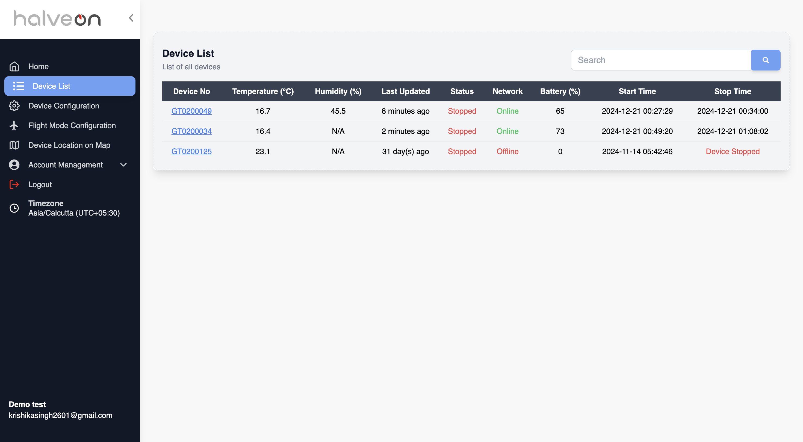
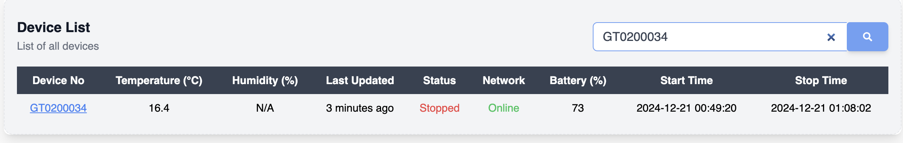
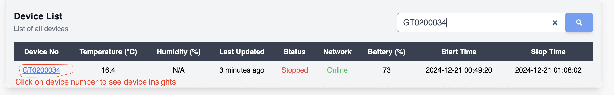
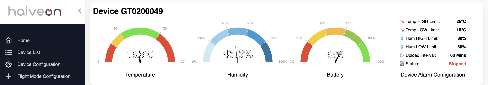
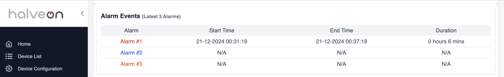
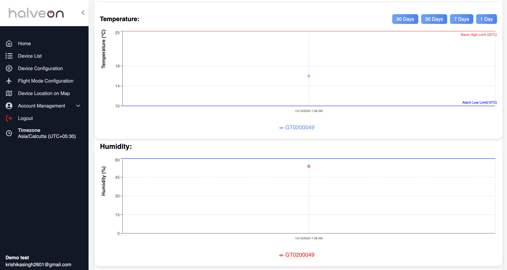
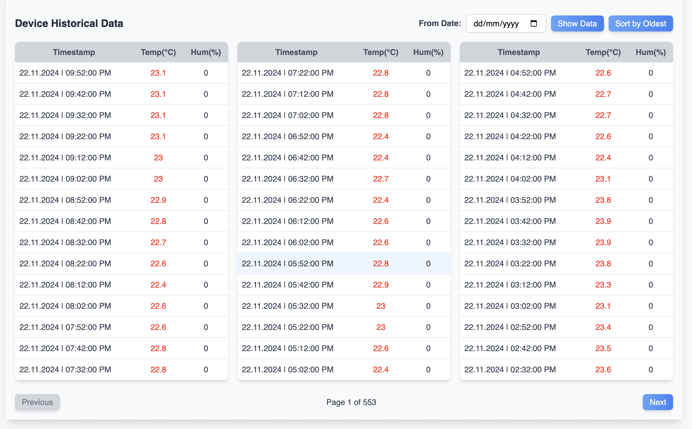

# Device List Documentation

## Overview
The **Device List** feature provides a comprehensive table displaying all devices in the system. The table includes essential details like device number, temperature, humidity, last updated time, status, network status, battery percentage, start time, and stop time. The feature also allows filtering, searching, and navigating to detailed device analysis for each device.

---

## Features

### 1. Device Table
#### Columns:
- **Device Number**: Displays the unique ID of the device.
- **Temperature (°C)**: Current temperature recorded by the device.
- **Humidity (%)**: Current humidity recorded by the device (if applicable).
- **Last Updated**: Timestamp of the last data update from the device.
- **Status**: Indicates whether the device is recording, configured, or stopped.
- **Network**: Displays network status as Online or Offline.
- **Battery (%)**: Current battery level of the device.
- **Start Time**: Timestamp of when the device started recording.
- **Stop Time**: Timestamp of when the device stopped recording or displayed as "Device Stopped" for errors.

---

### 2. Search and Filter
- **Search Bar**: Allows searching by device number.
- **Filtering**: Data can be filtered based on specific criteria like device number.

---

### 3. Navigation to Device Details
- Clicking on a **Device Number** navigates to the detailed analysis page for that specific device.

---

## Device Details Page

### A. Current Device Metrics
- **Temperature Gauge**: Displays the current temperature of the device with colored thresholds (red for alarms, green for normal).
- **Humidity Gauge**: Displays the current humidity level of the device.
- **Battery Status Gauge**: Displays the current battery level.
- **Device Alarm Configuration**:
  - Temperature High and Low Limits.
  - Humidity High and Low Limits.
  - Upload Interval.
  - Current Device Status (e.g., Recording, Configured).

---

### B. Alarm Details
- **Latest Alarms**:
  - Displays the last 3 alarms triggered for the device.
  - Columns:
    - **Alarm Name**: Hyperlinked alarm details.
    - **Start Time**: Timestamp of when the alarm started.
    - **End Time**: Timestamp of when the alarm ended or "Ongoing."
    - **Duration**: Total duration of the alarm (calculated in real-time).

---

### C. Temperature and Humidity Charts
- **Charts**:
  - Line graphs for temperature and humidity.
  - Threshold markers for alarms.
- **Filters**:
  - **1 Day, 7 Days, 30 Days, 90 Days**: Quick filtering options for historical data.
  - **Custom Date Range**: Select a specific range for detailed analysis.
- **Threshold Highlighting**: Data points above/below thresholds are highlighted.

---

### D. Historical Data Table
- **Table Layout**:
  - Columns:
    - **Timestamp**: Data collection time.
    - **Temperature (°C)**: Recorded temperature (highlighted if above threshold).
    - **Humidity (%)**: Recorded humidity (highlighted if above threshold).
- **Sorting and Filtering**:
  - Default: Newest to Oldest.
  - Custom Options:
    - **Oldest to Newest**.
    - **Custom Date Filtering**.
- **Pagination**: Displays data across multiple pages for better usability.

---

## Actions and Interactivity

### 1. Search and Filter
- Users can quickly search for devices and sort data by various parameters.

### 2. Navigation
- Clicking the **Device Number** navigates to the device’s detailed view, allowing for in-depth analysis and historical data review.

### 3. Insights
- Highlighted temperature and humidity points provide immediate visual insights into alarms or threshold violations.

This documentation ensures every feature within the **Device List** and **Device Details** sections is comprehensively outlined for seamless use and understanding.
