# HalveonCloud - Home Page Features

The **Home Page** of HalveonCloud serves as the central hub for monitoring, analyzing, and managing your devices. It provides an intuitive interface for visualizing data, managing devices, and accessing critical metrics.

---

## 1. Temperature and Humidity Charts

The **Temperature and Humidity Charts** provide real-time and historical insights into the environmental conditions monitored by your devices.

### Key Features:
1. **Temperature Data**:
   - Displays historical temperature readings for selected devices.
   - Highlights anomalies or threshold breaches in the temperature trend.
   
2. **Humidity Data**:
   - Visualizes the humidity trends over time.
   - Tracks humidity alarm levels and changes for specific devices.

3. **Device Selection**:
   - Multi-select dropdown to view data for one or multiple devices.
   - Color-coded device labels for easy identification on charts.

4. **Date Range Filters**:
   - Predefined filters: 1 Day, 7 Days, 30 Days, and 90 Days.
   - Custom filters: Select "From" and "To" dates for specific analysis periods.

5. **Hover Insights**:
   - Hover over data points to view precise readings (e.g., temperature, humidity, timestamps).

### Temperature and Humidity Chart:
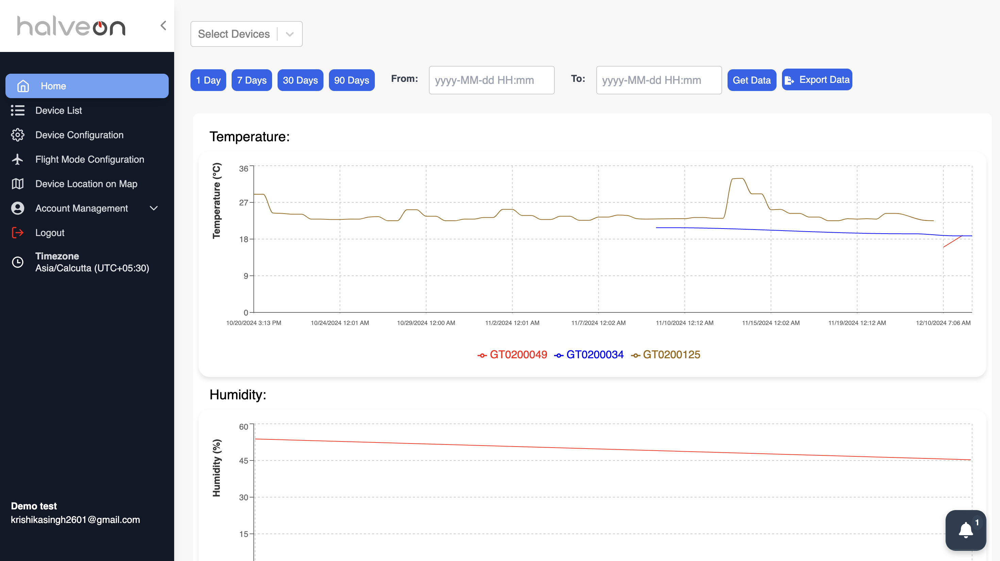

---

## 2. Dashboard Statistics Overview

The **Dashboard Statistics Cards** provide a high-level summary of your device fleet, highlighting important metrics:

### Key Metrics:
1. **Temperature Alarms**:
   - Counts of devices exceeding temperature thresholds.
   - Segregated into "Good" and "Alarm" states.

2. **Humidity Alarms**:
   - Displays the number of devices with humidity alarm conditions.
   - Real-time updates for changing conditions.

3. **Battery Status**:
   - Visual indicator of devices with low battery levels.
   - Differentiates between "Good" and "Low Battery" devices.

4. **Device States**:
   - **Recording**: Number of devices actively collecting data.
   - **Configured**: Devices that are ready but not recording.
   - **Stopped**: Devices that have been stopped or are offline.

5. **Statistics Summary**:
   - Total count of devices in each state.
   - Overview of devices triggering alarms for quick troubleshooting.

### Dashboard Statistics:
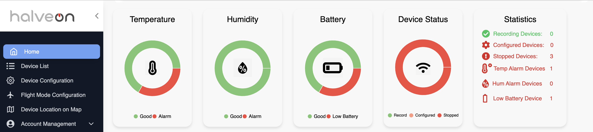

---

## 3. Device List Table

The **Device List Table** is a detailed overview of all registered devices, offering actionable controls and real-time insights.

### Columns:
1. **Device Number**: Unique identifier for each device (clickable for detailed view).
2. **Temperature (°C)**: Latest recorded temperature reading.
3. **Humidity (%)**: Latest recorded humidity reading.
4. **Status**: Current status of the device (e.g., Recording, Stopped, Configured).
5. **Network**: Network connectivity status (Online/Offline).
6. **Battery (%)**: Current battery percentage for the device.
7. **Start Time**: Time when recording began.
8. **Stop Time**: Time when recording stopped.
9. **Actions**:
   - Start/Stop recording.
   - Access detailed configuration settings.

### Device List Table:
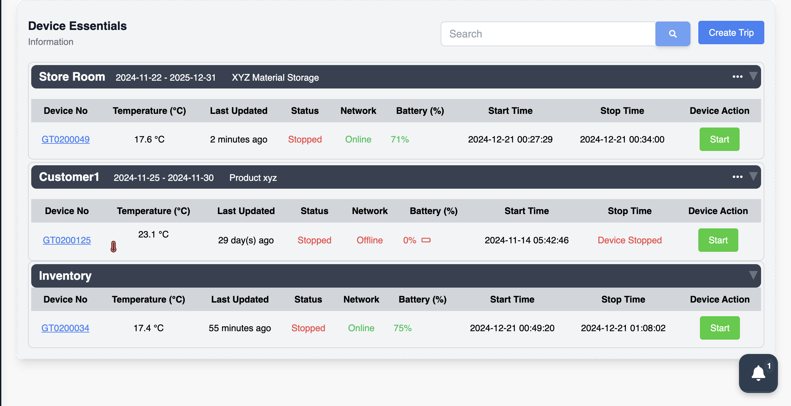

---

## 4. Device Management Actions

### Features:
1. **Start Recording**:
   - Begin data recording for selected devices.
   - Only accessible to primary users (restrictions for secondary users).

2. **Stop Recording**:
   - Halt data recording for devices.
   - Provides reasons for stoppage (e.g., manual stop, low battery).

3. **Device Configuration**:
   - Modify device settings, such as recording intervals, alarm thresholds, and operational modes.
   - Includes advanced modes:
     - **Low Power Mode**: Extend battery life.
     - **Airplane Mode**: Prevent recording during flights.

### Device Management:
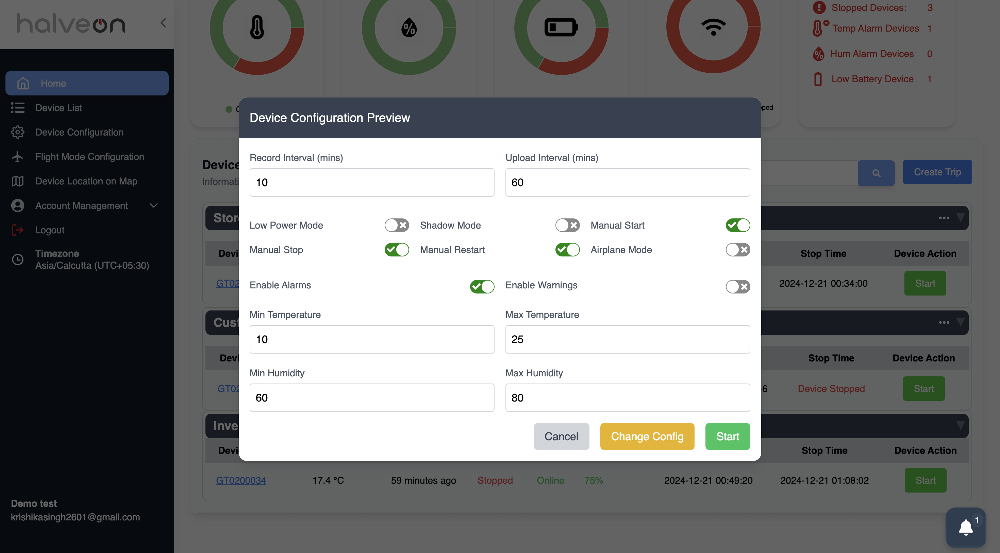

---

## 5. Export Device Data

### Key Features:
1. **Device Selection**:
   - Choose one or multiple devices to export data for analysis.
   
2. **Date Range Selection**:
   - Specify "From" and "To" dates for data export.

3. **Export Interval**:
   - Select time intervals (in minutes) for data aggregation.

4. **Export Options**:
   - **CSV**: For raw data analysis in spreadsheets.
   - **PDF**: Printable reports for sharing or documentation.
   - **Email**: Send reports directly to recipients.

### Steps to Export:
1. Click **Export Data**.
2. Select the desired device(s).
3. Choose the date range and export interval.
4. Select the format (CSV, PDF, or Email).
5. Click **Export** to initiate the process.

### Export Device Data:
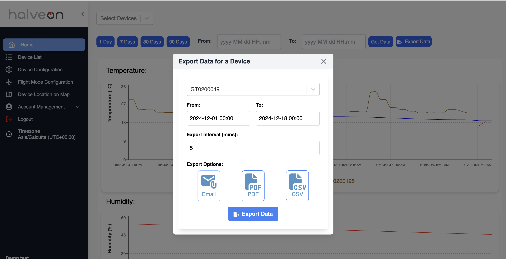

---

## 6. Notifications

The **Notifications Panel** provides alerts and updates for the following:
- Successful data exports (e.g., email confirmation).
- Device alarm triggers (temperature, humidity, or battery).
- Connectivity issues (offline devices).

### Notifications:
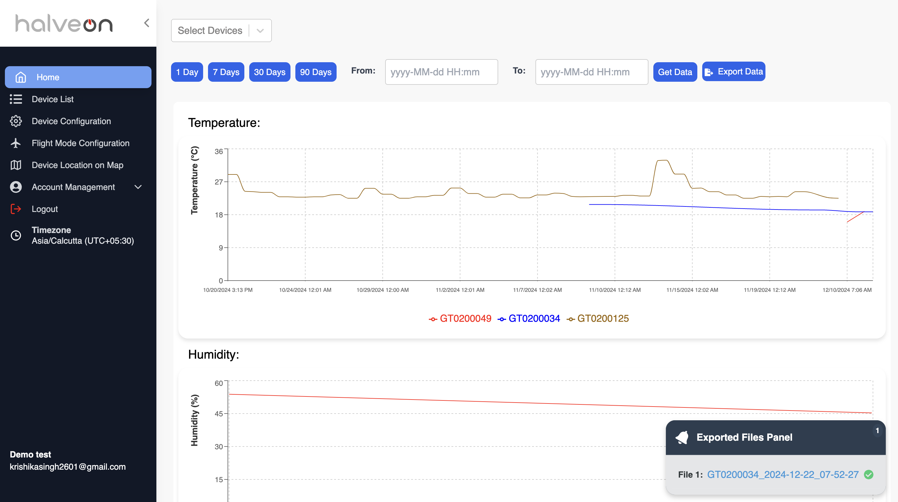

---

## 7. Date Range Filters

The **Custom Date Range** feature enables tailored analysis:
1. Select "From" and "To" dates to define the desired timeframe.
2. Filters applied to charts, tables, and export data.

### Custom Date Range:
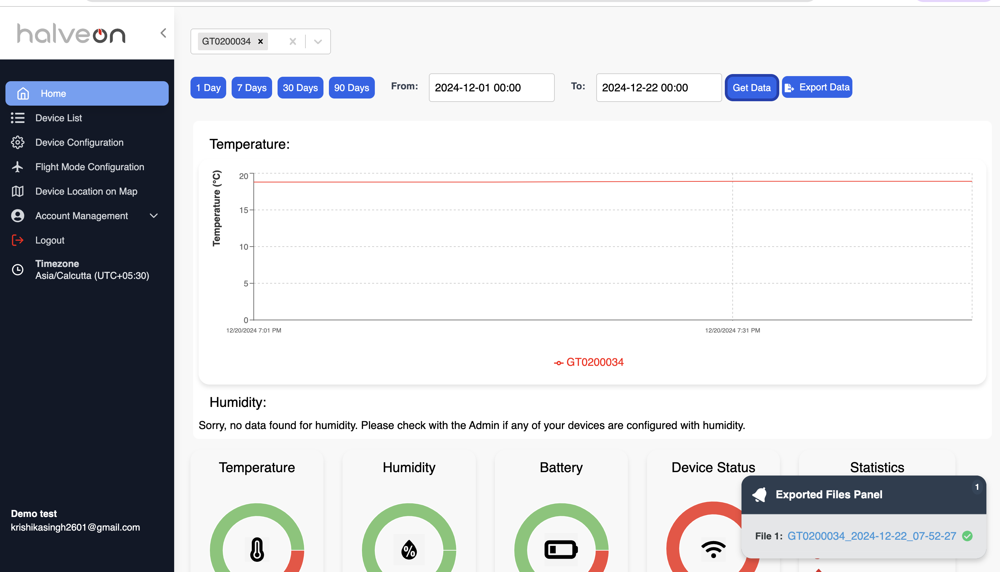

---

## 8. Trips Feature 

The **Trips Feature** in HalveonCloud allows users to organize their devices under trips, providing a structured and detailed way to manage device data and operations.

---

### Overview

The Trips Feature includes the following functionalities:
- **Create Trip**: Add a new trip with details like name, date range, and assigned devices.
- **Edit Trip**: Update the details of an existing trip.
- **Delete Trip**: Remove a trip, moving its devices back to the inventory.
- **Device Assignment**: Assign devices to a trip and manage them efficiently.
- **Collapsible View**: Collapse or expand trip details for a streamlined interface.

---

### Create Trip

##### Steps to Create a Trip:
1. Click on the **Create Trip** button.
2. Fill in the trip details:
   - **Trip Name**: Name of the trip.
   - **From Date**: Start date of the trip.
   - **To Date**: End date of the trip.
   - **Description**: Optional description for the trip.
   - **Select Devices**: Choose devices to assign to the trip.
3. Click **Submit** to save the trip.

#####  Screenshot
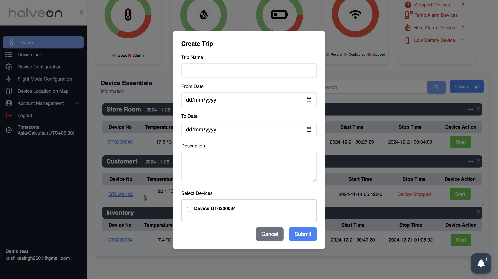

---

### Edit Trip

#### Steps to Edit a Trip:
1. Click on the **...** menu beside a trip and select **Edit**.
2. Update the required details in the **Edit Trip** modal:
   - Modify trip name, date range, description, or devices.
3. Click **Save Changes** to apply the updates.

#### Screenshot
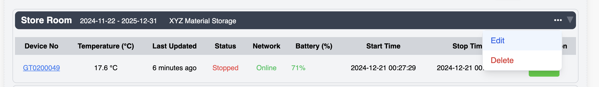
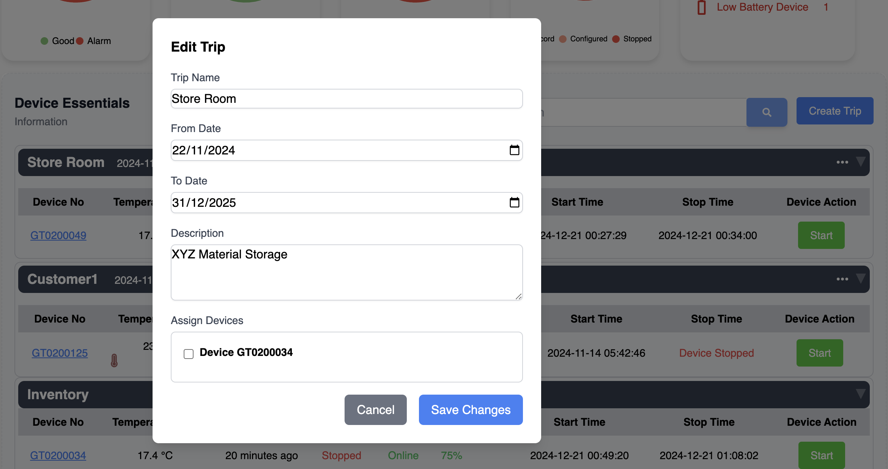

---
### Delete Trip

#### Steps to Delete a Trip:
1. Click on the **...** menu beside a trip and select **Delete**.
2. Confirm the deletion in the prompt.
3. All devices under the deleted trip will be moved back to the inventory.

#### Screenshot
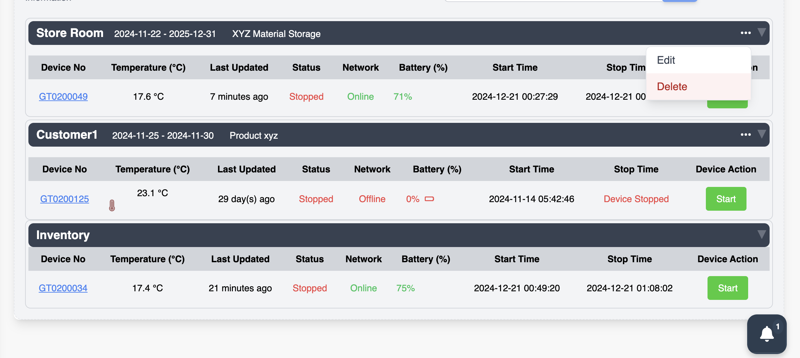
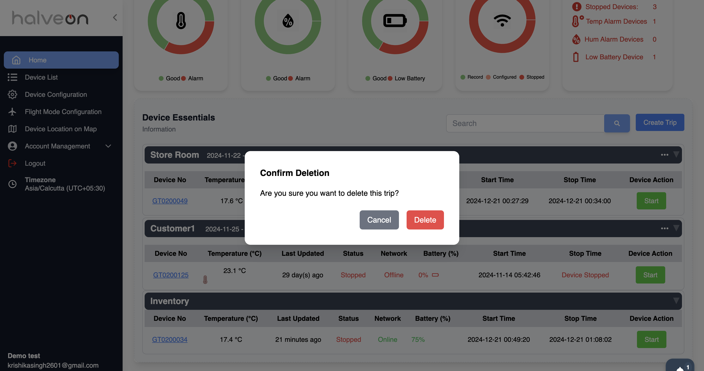

---

### Collapsible View

#### Steps to Collapse or Expand Trips:
1. Use the arrow beside each trip's name to collapse or expand its details.
2. A collapsed view provides a simpler display, showing only the trip name and basic details.

#### Screenshot
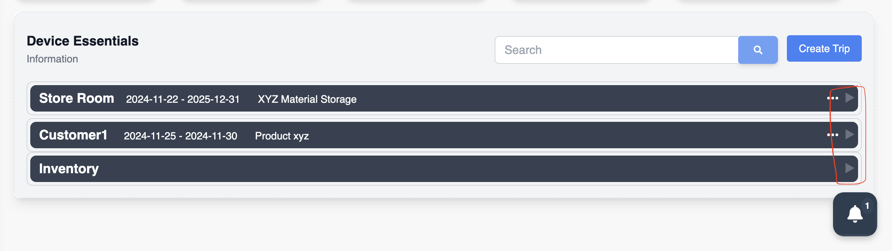

---

### Device Inventory Management

When creating, editing, or deleting trips:
- Devices in a trip are removed from the **Inventory** list.
- Deleted trips return the devices back to **Inventory**, making them available for reassignment.

---

### Use Cases

- **Organize Devices**: Group devices under trips based on project, location, or time frame.
- **Streamlined Management**: Easily assign, reassign, or update device configurations within trips.
- **Data Accuracy**: Ensure devices are accurately tracked under the appropriate trips.

---

Let me know if there’s anything else you’d like to add or modify!

---
