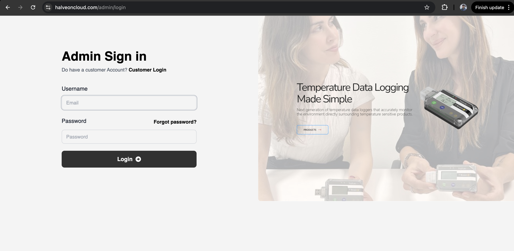

# Admin Login

The Admin Login page is for administrators to manage the HalveonCloud platform and customer accounts.

## Steps to Login
1. Navigate to the **Admin Login** page.
2. Enter your **Username** and **Password**.
3. Click the **Login** button.

## Admin Capabilities
- Add or manage customer accounts.
- Monitor platform metrics and activity logs.
- Configure system-wide settings for device monitoring.
