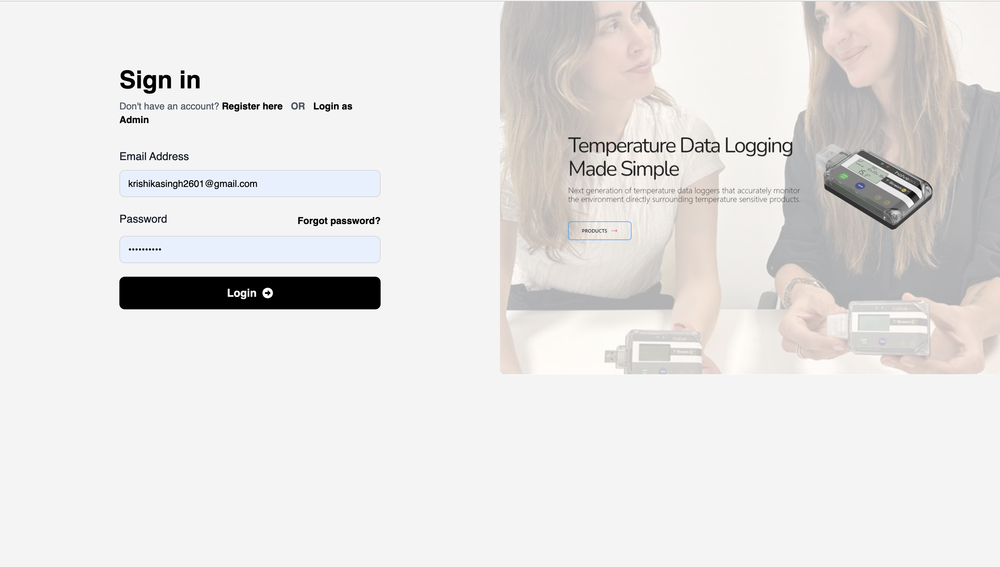

# Customer Login

The **Customer Login** page allows existing customers to access their HalveonCloud dashboard and manage their devices.

---

## Steps to Login:

1. Navigate to the **Customer Login** page.
2. Enter your registered **Email Address** and **Password**.
3. Click the **Login** button.
4. If you forgot your password, click the **Forgot Password?** link to reset it.

---

## Features Available After Login:

### 1. Device Dashboard
- Monitor real-time and historical data for temperature and humidity.
- View graphical representations for easy analysis.

---

### 2. Device Management
- Configure device settings like record intervals, alarms, and modes.
- Start or stop devices as needed.

---

### 3. Flight Mode Configuration
- Add and manage flight details for device usage during travel.
- Set departure and arrival locations with radius and flight duration.

---

### 4. Export Data
- Download monitoring data in CSV format for offline analysis.
- Export temperature and humidity readings for custom date ranges.

---

This login system is designed to provide seamless access for all customers while maintaining security and role-based restrictions.
